# IITJ-BHARAT-PLATE-TAG  
Bharat Plate Tag: Multi-Approach Vehicle Car and Bike Indian Plate Detection system.

[![Contributors][contributors-shield]][contributors-url]  
[![Forks][forks-shield]][forks-url]  
[![Stargazers][stars-shield]][stars-url]  
![Issues][issues-shield]

## Live Demo: [IITJ-DEMO](http://13.49.170.231:8501/)
#### User : **admin** | Password: **1234**

---

## 🧭 Overview

This project is a Computer Vision Capstone from IIT Jodhpur under supervision of **PROF. PRATIK MAZUMDER**, where we focused on developing a robust and adaptable Indian number plate recognition system with name **Bharat Plate Tag**. We have integrated multiple techniques—Deep Learning (YOLOv8, CNN), Optical Character Recognition (Tesseract OCR), and traditional Computer Vision methods (Canny, Morphology, HSV Color Segmentation)—to handle the diverse challenges of real-world Indian traffic conditions. The final product is a Streamlit-powered web application  which is hosted on AWS Windows Server that supports both real-time and batch analysis of images and videos.

---

## 🔧 Setup Instructions

### ⚙️ Python Environment Setup

```bash
python -m venv env
# Activate Virtual Environment:
source env/Scripts/activate        # Git Bash
.\env\Scripts\Activate.ps1         # PowerShell
```

### 📦 Install Required Packages

```bash
pip install streamlit opencv-python-headless ultralytics numpy pillow tensorflow matplotlib pytesseract scikit-learn filterpy openpyxl 
pip freeze > requirements.txt
```

---

## 🧠 Model Training & Usage

### YOLOv8: Indian RC Plate Detector for Bike and Cars 

- **Training File**: `iitj_cv_bharat_plate.yaml`

```yaml
dataset:
  train: dataset/images/train
  val: dataset/images/val
nc: 1
names: ["license_plate"]
```

```bash
yolo task=detect mode=train model=yolov8n.pt data=iitj_cv_bharat_plate.yaml epochs=50
yolo task=detect mode=val model=runs/detect/train/weights/best.pt data=iitj_cv_bharat_plate.yaml
```

- **Output model**: `models/iitj_cv_bharat_plate.pt`

### CNN Binary Classifier: Plate / No Plate

- Files:
  - `generate_no_plate.py`: Creates dummy non-plate images using noise
  - `train_cnn.py`: Trains CNN on labeled plate/no_plate images

```bash
python generate_no_plate.py
python train_cnn.py
```

#### `train_cnn.py` Highlights:

- Uses **ImageDataGenerator** for image augmentation
- CNN with 3 convolution layers, binary sigmoid output
- Saved models:
  - `cnn_plate_classifier_best.h5`
  - `cnn_plate_classifier_latest.h5`
  - `cnn_plate_classifier.h5`
- Graphs: `training_metrics.png`

```python
train_datagen = ImageDataGenerator(
    rescale=1./255, rotation_range=10, zoom_range=0.1,
    width_shift_range=0.1, height_shift_range=0.1,
    shear_range=0.1, horizontal_flip=True)

val_datagen = ImageDataGenerator(rescale=1./255)
```

---

## 🗂 Project Structure

```
BHARAT-PLATE-TAG/
├── data/
│   └── database.db
├── env/ (Need to Setup after installing)
├── images/
│   └── plate_template.png
├── models/
│   └── runs
│   └── Training 
│   │   └── char_data <--[Data set for Training of Character to train model]
│   │   └── cnn_classifier_data <--[Data set for Training for custom CNN to train model]
│   │   │      ├── train/with_plate/, no_plate/
│   │   │      └── val/with_plate/, no_plate/
│   │   └── numberplate_dataset <--[Data set for Training of Indian Number plate to train model]
│   ├── iitj_cv_bharat_plate.pt
│   ├── cnn_plate_classifier_best.h5
│   ├── cnn_plate_classifier.h5
│   ├── cnn_plate_classifier_latest.h5
│   └── yolov8n.pt
│   └── char_train_model.py
│   └── train_cnn.py
│   └── generate_no_plate.py
├── assets/
│   │   └── images  <--[Sample Images to Test]
│   │   │     └── sample.jpg 
│   │   │     └── sample1.jpg
│   │   └── videos <--[Sample Video to Test]
│   │   │     └── video1.mp4
│   │   │     └── video2.mp4
│   │   │     └── video3.mp4
│   └── report.pdf  <--3[Report]
│   └── plate_template.png
│   └── training_metrics.png
├── src/
│   ├── _init_.py
│   ├── cnn_plate_pipeline.py
│   ├── SQLManager.py
│   ├── PlateGen.py
│   └── sort.py
├── app.py
├── README.md
├── requirements.txt
├── setup.sh
└── webapp.sh
```
## 🗂 Project Report
[Project Report](./assets/Group_13_report.pdf)

---

## 🔍 Detection Modes Explained

🔍 Detection Modes Overview
This system is trained and evaluated exclusively on Indian number plate datasets, both self-collected and sourced from public repositories. While the dataset size was limited (~1,500 labeled samples total across modes), the system was engineered to be modular, lightweight, and extensible for real-world deployment.

1. **YOLOv8 (Car Detection)**
   - Model: yolov8n.pt (nano variant, fast and efficient)
   - Training: ~600 annotated Indian car plate images
   - Output: Bounding boxes with confidence scores

   - ⚠️ Challenges: Performance drops under night-time or occluded conditions
   - ✅ Improvement Area: Increase training data with diverse lighting and angles

2. **Traditional CV (Canny + Contours)**
   - Method: Classic edge detection + contour filtering
   - Data: No training needed – rule-based

   - ⚠️ Challenges: Sensitive to noise, shadows, and motion blur
   - ✅ Improvement Area: Add adaptive thresholds or hybrid with DL-based mask

3. **Color Segmentation (HSV Filtering)**
   - Method: HSV masking for white/yellow plates
   - Data: Tuned on ~300 images with good color contrast

   - ⚠️ Challenges: Not robust in varied sunlight or dirt-covered plates
   - ✅ Improvement Area: Dynamic HSV calibration or switch to YCbCr space

4. **Edge + Morphological Filtering (Bike Plates)**
   - Method: Canny + dilation/erosion post-processing
   - Data: ~200 annotated bike images used for validation

   - ⚠️ Challenges: Struggles with stylized or bent plates on two-wheelers
   - ✅ Improvement Area: Integrate shape-based heuristics or CNN-based filters

5. **CNN Classifier (Bike/Car Detection)**
   - Model: Custom CNN (3 conv layers, trained with Keras)
   - Training: ~1,000 cropped image patches (balanced: plate / no_plate)

   - ⚠️ Challenges: Occasional false negatives on blurry/angled inputs
   - ✅ Improvement Area: Augmentation (rotation, blur) and add more hard negatives

6. **OCR Plate Recognition (Optional Check)**
   - Tool: Tesseract OCR (--psm 7 mode)
   - Use: Optional validation layer for extracted plates

   - ⚠️ Challenges: OCR misreads non-standard fonts and dirty plates
   - ✅ Improvement Area: Integrate custom CNN for character-level recognition (already started)


---

## 🚀 Running the Application

1. Activate the environment:
```bash
source env/Scripts/activate
```

2. Launch the Web App:
```bash
streamlit run app.py
```

3. Optional: Install [Tesseract OCR](https://github.com/tesseract-ocr/tesseract/releases) and C++ 15

---

## 📸 Screenshots

### Login UI
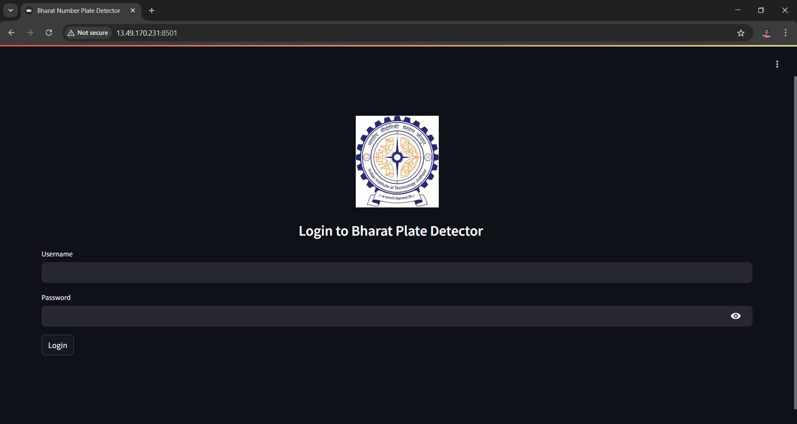 

### Landing UI
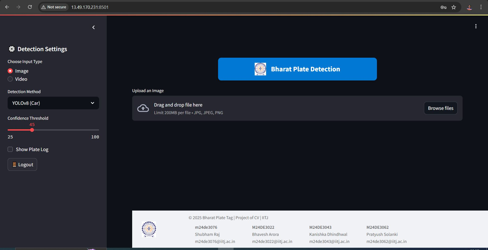 

### YOLOv8 (Car Detection) 
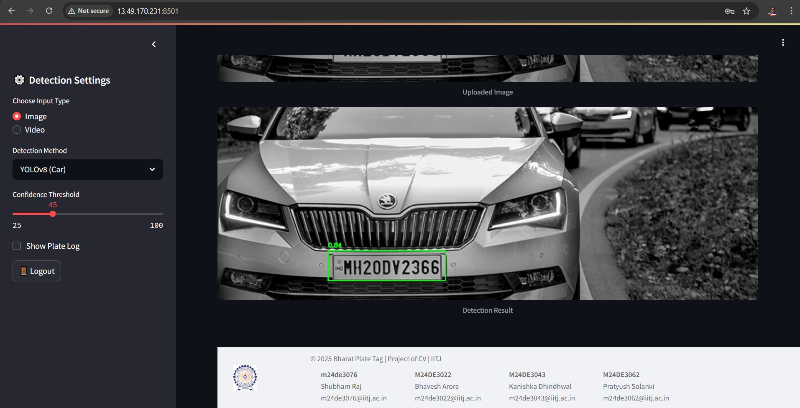 

### Traditional CV (Canny + Contours) 
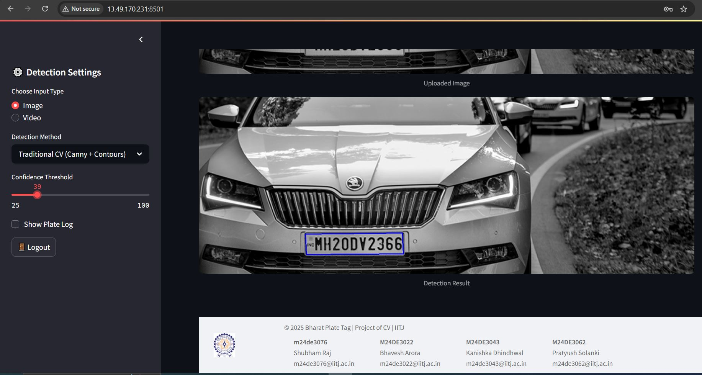 

### Color Segmentation (HSV Filtering)
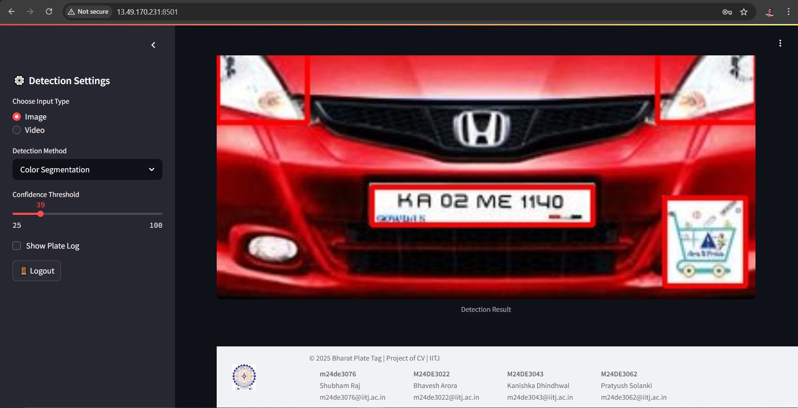 

### Edge + Morphological Filtering (Bike Plates)
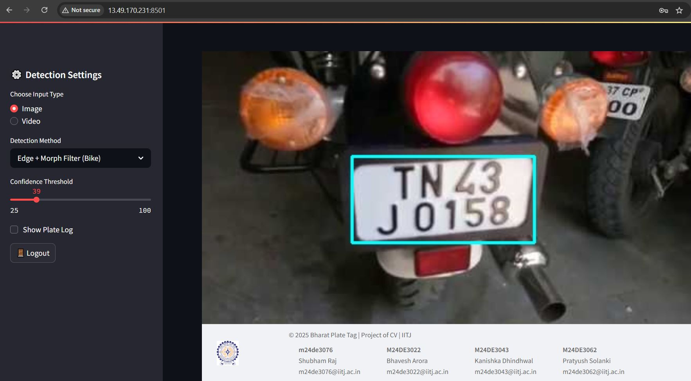 

### CNN Classifier (Bike/Car Detection)
 
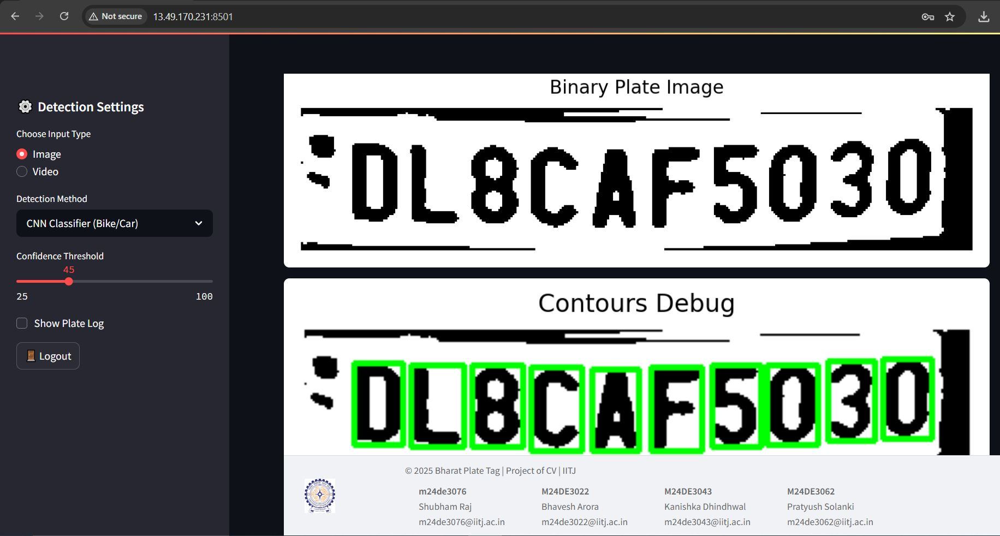 
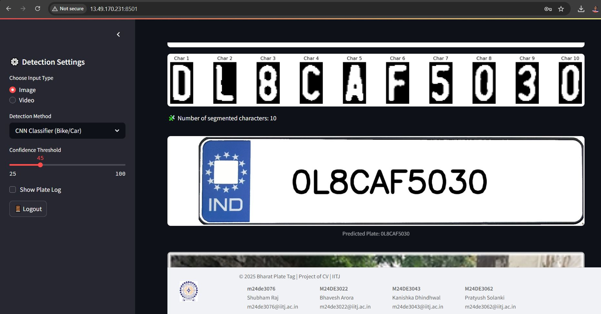 
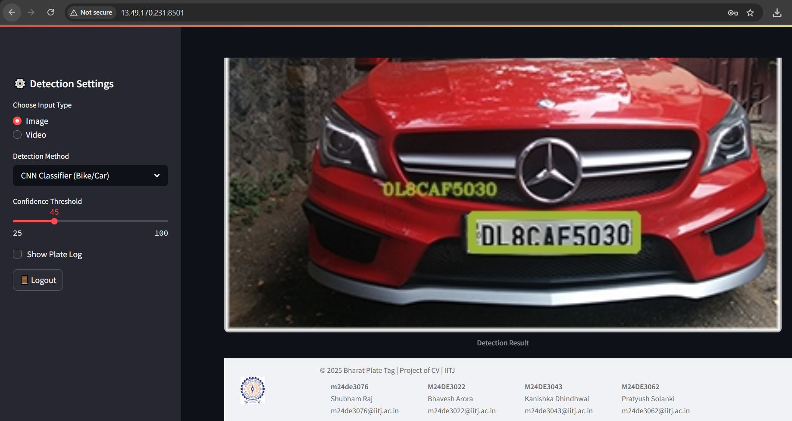 
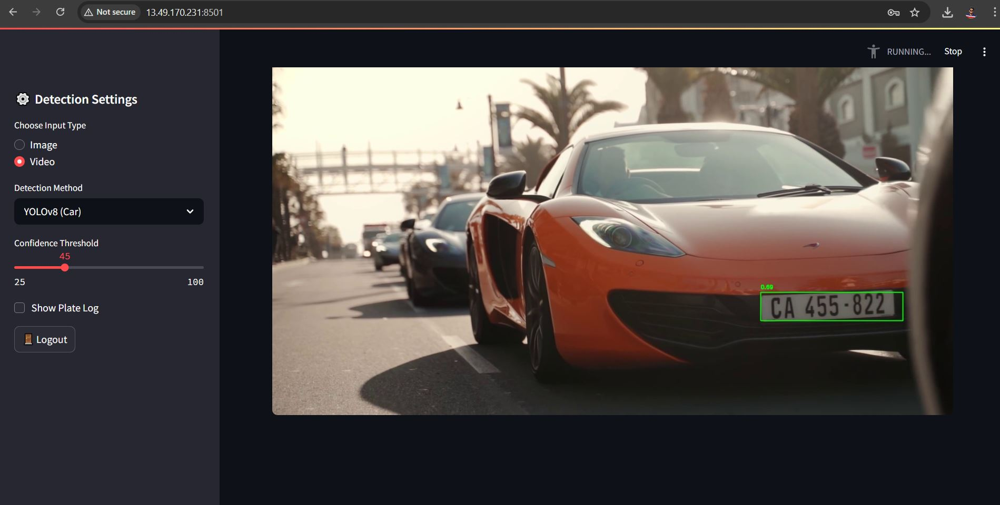 

### Training Models
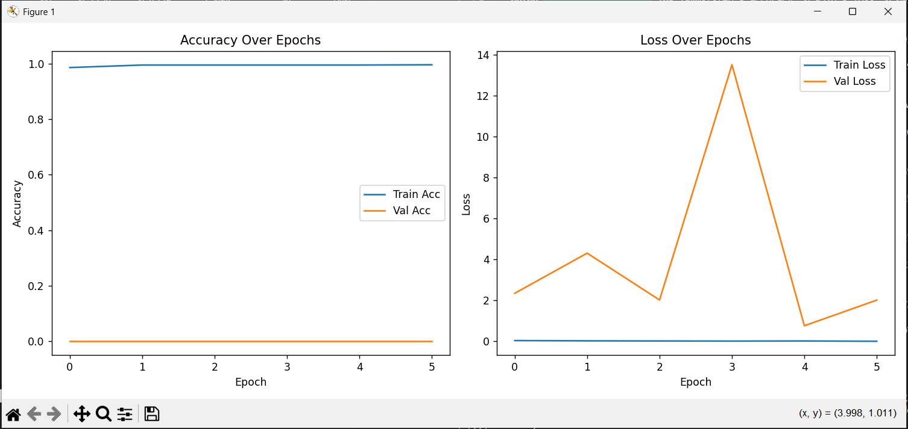 
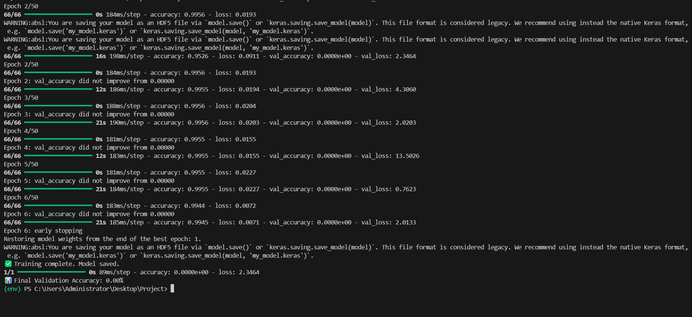 
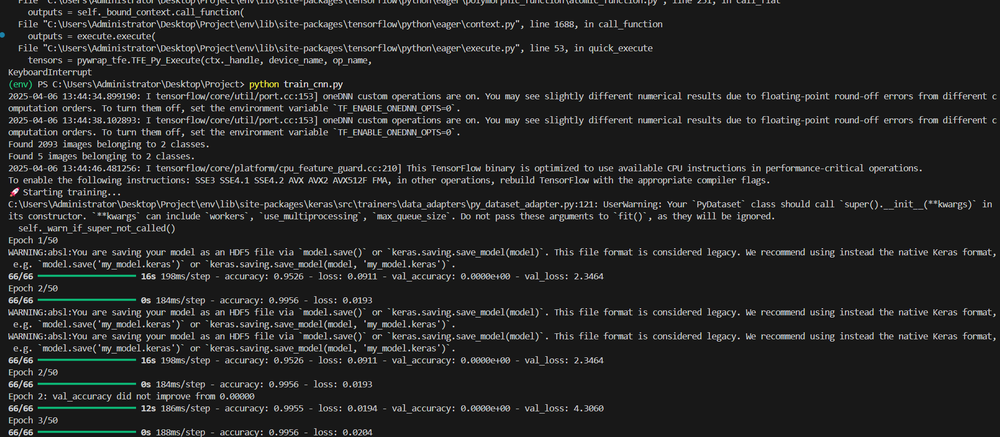 
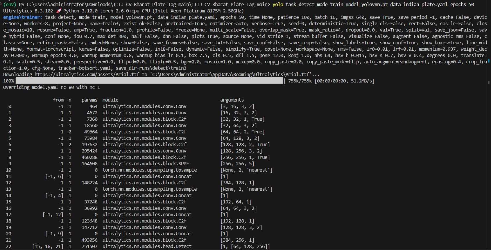 
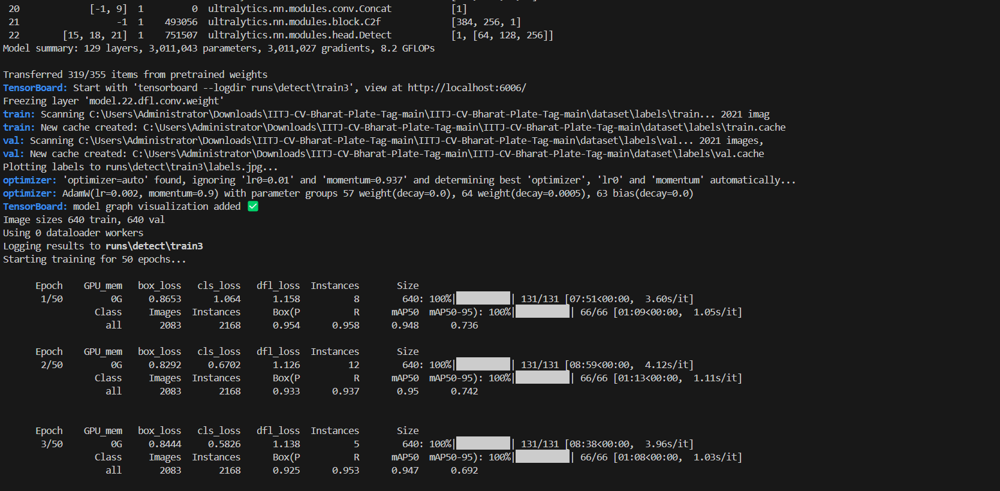 

### OCR Plate Recognition (Optional Check)
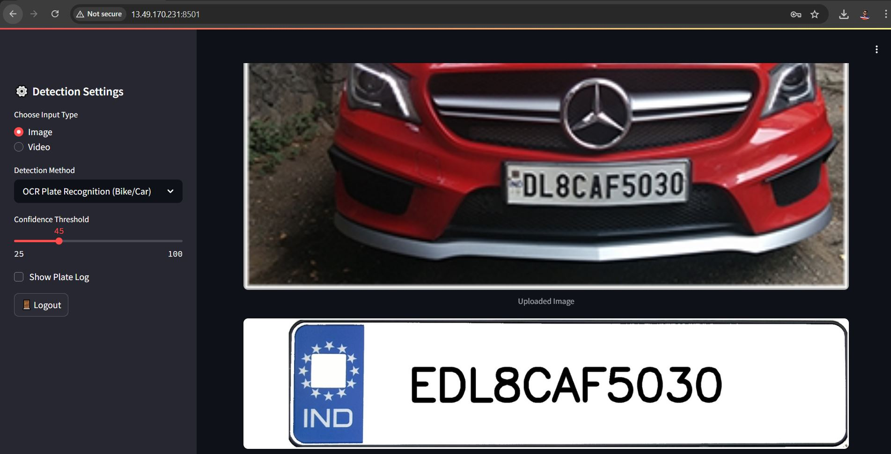 
---

## 🧪 Technologies Used

### Backend
- **Flask**
- **Tesseract OCR**
- **YOLOv8 (Ultralytics)**
- **TensorFlow + Keras**
- **OpenCV**
- **SQLite**

### Frontend
- **Streamlit**
- **HTML + CSS Styling**
- **Base64 Image Embeds**
- **Interactive Sliders / Toggles**

---

## 🧑‍💻 Team

| Roll No | Name | Email |
|---------|------|-------|
| **M24DE3076** | Shubham Raj | m24de3076@iitj.ac.in |
| **M24DE3022** | Bhavesh Arora | m24de3022@iitj.ac.in |
| **M24DE3043** | Kanishka Dhindhwal | m24de3043@iitj.ac.in |
| **M24DE3062** | Pratyush Solanki | m24de3062@iitj.ac.in |


### Contributors
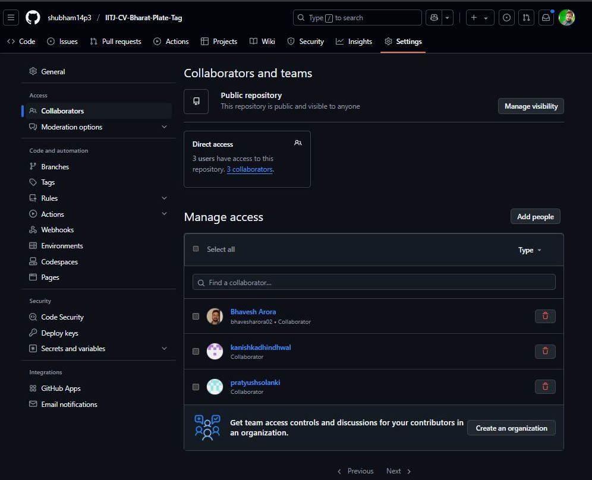 
---

## 🌱 Future Enhancements

- Incorporate vehicle metadata detection (type, color, region)
- Streamline deployment to cloud via Docker or EC2
- Support multi-language plate decoding

---

## 📢 Acknowledgements

- Supported by [IIT Jodhpur](https://www.iitj.ac.in/)
- Dataset inspired by Indian Data from Kaggle

---

## 🌟 Show Your Support

Give a ⭐ on [GitHub](https://github.com/shubham14p3) if you found this useful.

---

<!-- MARKDOWN LINKS & BADGES -->
[contributors-shield]: https://img.shields.io/github/contributors/shubham14p3/IITJ-CV-Bharat-Plate-Tag.svg?style=flat-square  
[contributors-url]: https://github.com/shubham14p3/IITJ-CV-Bharat-Plate-Tag/graphs/contributors  
[forks-shield]: https://img.shields.io/github/forks/shubham14p3/IITJ-CV-Bharat-Plate-Tag.svg?style=flat-square  
[forks-url]: https://github.com/shubham14p3/IITJ-CV-Bharat-Plate-Tag/network/members  
[stars-shield]: https://img.shields.io/github/stars/shubham14p3/IITJ-CV-Bharat-Plate-Tag.svg?style=flat-square  
[stars-url]: https://github.com/shubham14p3/IITJ-CV-Bharat-Plate-Tag/stargazers  
[issues-shield]: https://img.shields.io/github/issues/shubham14p3/IITJ-CV-Bharat-Plate-Tag.svg?style=flat-square